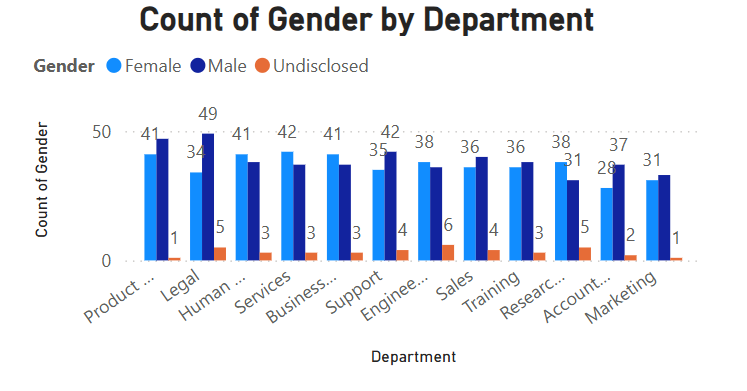

# Palmoria HR Analytics
Gender equality Analysis for **Palmoria Group**

# Dashboard

This repository contains the HR Analytics report and visuals developed for **Palmoria Group**, a manufacturing company in Nigeria. The purpose of this project is to uncover insights on gender-related issues, salary distribution, and performance-based bonus allocation to support HR decision-making.

---

## Project Overview

**Case Background**  
Palmoria Group faced media criticism over gender inequality across its three regions. This project was initiated by the CHRO to identify areas of concern and offer data-driven recommendations using Power BI.

---

## Key Objectives

- Clean and prepare HR and bonus data
- Analyze gender distribution by region and department
- Evaluate employee performance ratings by gender
- Investigate gender pay gaps and identify departments/regions of concern
- Assess salary compliance with government regulation ($90,000 minimum)
- Allocate bonuses based on department and performance
- Present insights visually with interactive Power BI dashboards

---

## Folder Structure

| Folder         | Description                              |
|----------------|------------------------------------------|
| `/data`        | Raw and cleaned data files               |
| `/reports`     | Power BI (.pbix) report file             |
| `/visuals`     | Exported charts and visuals              |
| `/documentation`| Insights Notes     |

---

## Tools Used

- **Power BI Desktop** ([Download Here])(https://www.microsoft.com/en-us/download/details.aspx?id=58494)
- **Microsoft Excel**
- **DAX (Data Analysis Expressions)**
- **GitHub for documentation**

---

## Key Insights

- Certain departments show significant gender pay gaps.
- Several employees fall below the $90,000 regulatory salary threshold.
- Bonus allocation effectively highlights performance disparities by gender and region.

---

## Sample Visuals

| Gender Distribution | Salary Gap | Bonus by Region |
|---------------------|------------|-----------------|
|  |  |  |

---

## Questions Answered in This Project

This project was guided by key analytical questions provided by Palmoria Group’s CHRO. The following insights were derived and visualized using Power BI:

---

### Case Questions Addressed

1. **What is the gender distribution in the organization?**
   - Distilled by **region** and **department**.
   - Visualized using stacked column and clustered bar charts.

2. **What are the performance ratings by gender?**
   - Ratings (Average, Good, Poor, etc.) were converted into numeric scores.
   - Compared by gender to uncover any bias or pattern.

3. **Does a gender pay gap exist?**
   - Yes, gaps were identified in several departments.
   - The most significant disparities occurred in **Business Development** and **Support**.
   - Differences also analyzed by region.

4. **Does Palmoria meet the regulatory salary minimum of $90,000?**
   - **654 employees** were found to earn below $90,000.
   - Visualized using salary band charts grouped in $10,000 intervals.

5. **Which regions are most affected by the salary gap?**
   - **Kaduna** recorded the highest number of underpaid employees.
   - Salary band visual filtered by region.

6. **How is bonus pay allocated?**
   - Bonus computed based on a combination of **department** and **performance rating**.
   - Lookup tables and **DAX** logic used to assign correct bonus percentages.

7. **How much is paid in total compensation (salary + bonus)?**
   - A new column was created for each employee’s total compensation.
   - Summarized per **region** and **company-wide**.
   - **Total bonus payout:** $2.2M
  

   ## Prepared By:
   **Emmanuel Akpan**  
[LinkedIn Profile](https://www.linkedin.com/in/emmanuel-akpan-meta)  
[WhatsApp](https://wa.me/2348130081897)  
[GitHub Profile](https://github.com/Noble-Meta)

## License
This project is open-source and free to use for learning or portfolio purposes.

